<!-- ---------------------------------------- -->
<!--            GH PROFILE README             -->
<!-- ---------------------------------------- -->

<h1 align="center">Hi 👋, I'm Dhruv</h1>
<h3 align="center">AI • Machine Learning • Deep Learning • Computer Vision</h3>

  

---

##  About Me  
- 🔭 I work on **AI/ML, Deep Learning & Computer Vision**  
- 🤖 Interested in **Transformer models, Vision Models & Generative AI**  
- 🚀 Exploring **MLOps, Model Optimization, and Deployment**  
- 🧩 I love contributing to **open-source AI projects**  
- 🌱 Currently learning: **Advanced CV Models & ML Engineering**  

---

## 🚀 What Do I Do

- Neural Networks (CNNs, RNNs, Transformers)  
- Vision Tasks (Detection, Segmentation, Depth Estimation)  
- Model Optimization (ONNX, TensorRT)  
- Large-Scale Data Processing  
- ML Experimentation & Hyperparameter Tuning  

---

## 📊 GitHub Statistics & Analytics

<!-- Streak Stats -->

<!-- Activity Graph -->

<!--  -->

<!-- Profile Summary Cards -->

<table>
<tr>
<td width="50%">

</td>
<td width="50%">

</td>
</tr>
<tr>
<td width="50%">

</td>
<td width="50%">

</td>
</tr>
</table>

<!-- Profile Views Counter -->

 

---

## LeetCode Stats

  
  <!--  -->

---
## 📁 Projects

| Project | Tech stack | Description |
|---|---|---|
| [Personalized Cancer Diagnosis](https://github.com/Dhruv-D-Bhrasadiya/personalised-cancer-diagnosis) | Python, scikit-learn, TF-IDF, Streamlit, Jupyter | ML pipeline for mutation classification (9 classes) with TF-IDF feature engineering and a Streamlit demo. |
| [Cancer Diagnosis](https://github.com/Dhruv-D-Bhrasadiya/cancer-diagnosis) | Python, PyTorch, Jupyter | Notebooks and code for cancer detection experiments, model weights and training outputs. |
| [Depth Nav](https://github.com/Dhruv-D-Bhrasadiya/depth_nav) | Python, YOLO, MiDaS, Fuzzy Logic | Depth-aware robot navigation combining 2D detection with monocular depth fusion and a decision engine. |
| [AMIVRE](https://github.com/Dhruv-D-Bhrasadiya/AMIVRE) | Next.js, Tailwind, FastAPI, Celery, Redis, PostgreSQL, Qdrant | Autonomous market intelligence multi-agent system for real-time analysis. |
| [AlexNet](https://github.com/Dhruv-D-Bhrasadiya/AlexNet) | Python, PyTorch, Colab | Reimplementation of AlexNet with data augmentation, training scripts and code-to-paper mapping. |
| [Interactive CV Tool](https://github.com/Dhruv-D-Bhrasadiya/Interactive-CV-Tool) | Python, PyTorch, CV models, Jupyter | Toolkit for classification, detection and segmentation with model implementations and configs. |
| [Trash Detect](https://github.com/Dhruv-D-Bhrasadiya/Trash_Detect) | React, TypeScript, Supabase, PyTorch | Web app + ML pipeline for trash detection with a reward system and Supabase backend. |
| [Honey Price Predictor](https://github.com/Dhruv-D-Bhrasadiya/Honey_Price_Predictor) | Python, Flask/Streamlit, scikit-learn, pandas | Regression models and a web app to predict honey prices from chemical/pollen features. |
| [AI-Powered Cricket Analytics](https://github.com/Dhruv-D-Bhrasadiya/AI-Powered-Cricket-Analytics) | Python, OpenCV, MediaPipe, Streamlit | Real-time video processing and biomechanical analysis for cricket shot evaluation. |

## 💻 Tech Stack & Skills

<table>
<tr>
<td valign="top" width="33%">

### 🎨 Frontend Development

  <!--  -->
  <!--  -->
  <!--  -->
  
  <!--  -->
  <!--  -->
  
  

</td>
<td valign="top" width="33%">

### ⚙️ Backend Development

  <!--  -->
  
  <!--  -->
  
  
  
  <!--  -->
  <!--  -->

</td>
<td valign="top" width="33%">

### 🗄️ Databases

  
  
  
  <!--  -->
  
  <!--  -->

</td>
</tr>
</table>

<table>
<tr>
<td valign="top" width="33%">

### 💬 Programming Languages

  
  <!--  -->
  
  
  
  
  <!--  -->
  <!--  -->

</td>
<td valign="top" width="33%">

### 🤖 AI & Machine Learning

  
  
  
  
  
  
  
  
  
  

</td>
<td valign="top" width="33%">

### ☁️ DevOps & Deployment

  
  
  
  <!--  -->
  <!--  -->

</td>
</tr>
</table>

---

## 🌐 Connect With Me  
<!-- Replace links accordingly -->

  
  
  <!--  -->
  

---

## 🔥 Quot

> “The best way to predict the future is to create it.”

 

### ⭐ If you like my work, consider giving my repositories a star!  

---
